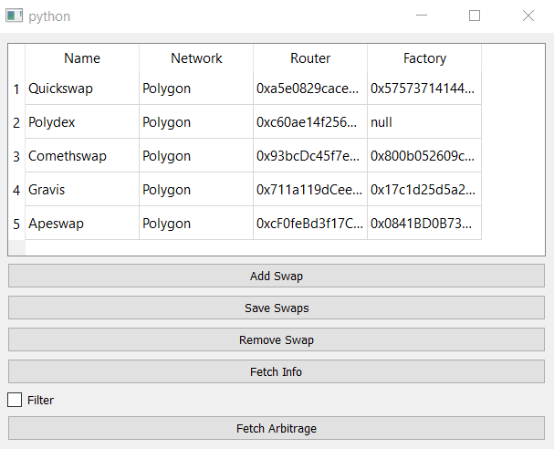

### Disclaimer:
This bot at its current speed is not actually able to make real money from executing triangular arbitrage. If you choose to use this bot for economic purposes, you’re doing so at your own risks.

This project was created when i was very unexperienced, approaching real coding for the first time, so expect the code of this project to be unoptimized, unstructured, unclean and mostly unfinished. I picked up this project after 2 years to write function documentation of it based on what i remembered and with the help of AI.

### Description:
Arbplus is a tool designed to completely automate the process
of triangular arbitrage:
1. fetch pair data
2. create triangles
3. find opportunities in real time
4. execute arb transaction on-chain

The key feature of this tool is that this automation is possible
with every DEX that is a Uniswap fork, such as Quickswap
and Sushiswap. The only user input needed is the name of the
dex, its router smart contract address and the network name. Everything is then
set to fetch data and start scanning for triangular arbitrage
opportunities.
This is made possible by not relying on different APIs for
every DEX, but rather gathering data on chain, making this method universally appliable.

### Usage:
**Add a new Uniswap fork:**
1. click on "Add Swap" and input the name, network and router
smart contract address of the wanted Uniswap fork, "factory" field is
optional as it will be obtained automatically.
2. click on "Save Swaps" once every needed information is added to save the newly added fork on file.
3. select the wanted fork and click on "Fetch Info" to fetch all required pair data. This
process might require some time based on how big the dex is.

**Fetch triangular arbitrage opportunities:**
1. select the wanted Uniswap fork and click on "Fetch Arbitrage" to start the arbitrage fetching loop. 
If there is the need to exclude some triangles from the arbitrage
   (tokens listed on the "tokensToExclude" csv of the selected
swap) or to only include triangles that have certain tokens
in them (tokensToInclude.csv), or if the amount of tokens to
spend needs to be limited (tokensLimits.csv), "Filter" checkbox needs to be checked.
Otherwise, every triangle fetched will be used.

### Documentation:
